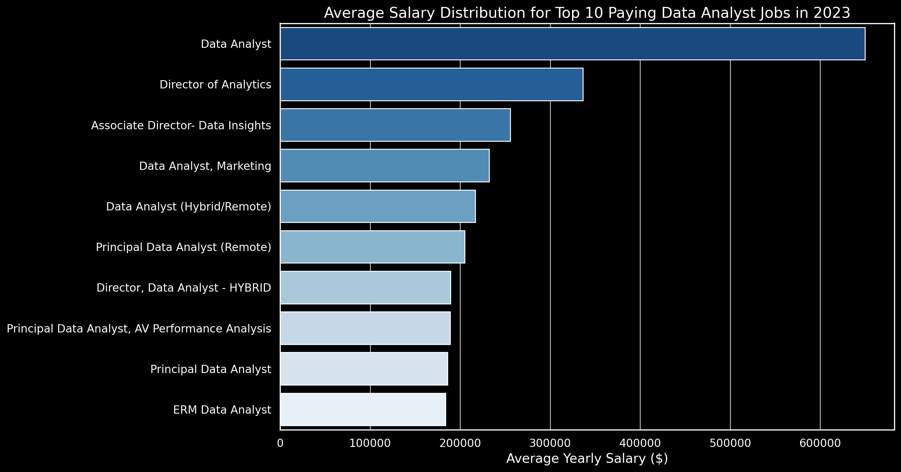
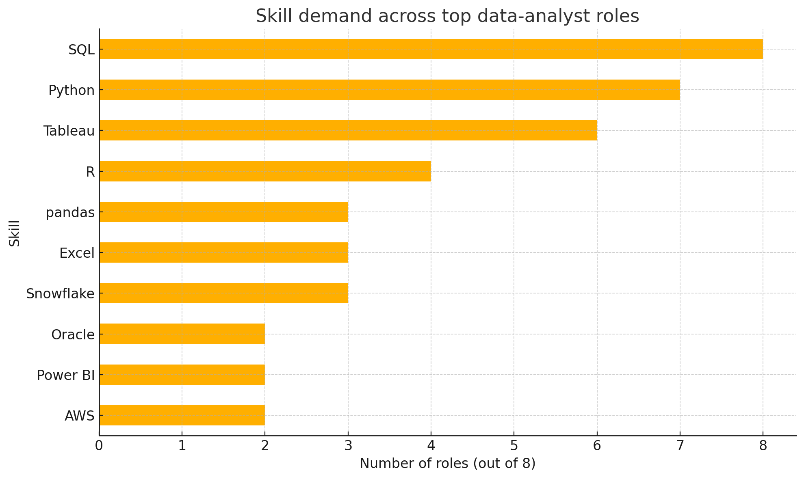

# Introduction
 📊 This project dives into the data job market! Focusing on data analyst roles, this project explores 💰 top-paying jobs,🔥 in-demand skills, top skills, and 📈 where high demand meets high salary in data analytics.

🔍 Wanna look further into the SQL queries? Check them out here: [project_sql folder](/project_sql/)
# Background
Driven by my intereset from learning SQL as someone wants to becaome a data analyst I pertake this project. In my quest to become data analyst, I wanted to navigate the data analyst job market more effectively, this project was born from a desire to pinpoint top-paid and in-demand skills, streamlining others work to find optimal jobs.

Data hails from the [SQL Course](https://www.lukebarousse.com/sql) of LukeBarousse. It's packed with insights on job titles, salaries, locations, companies and essential skills.

The questions I wanted to answer through my SQL queries were:

What are the top-paying data analyst jobs?
What skills are required for these top-paying jobs?
What skills are most in demand for data analysts?
Which skills are associated with higher salaries?
What are the most optimal skills to learn?

# Tools I used
For the deep dive into the data analyst job market, I ustilized the power of several key tools for my data analysis:

**SQL:** The backbone of this analysis was conducted through SQL, allowing me to query the database and unearth critical insights.
**PostgreSQL:** The chosen database management system, ideal for handling the job posting data.
**Visual Studio Code:** My go-to for database management and executing SQL queries.
**Git & GitHub:** Essential for version control and sharing my SQL scripts and analysis, ensuring collaboration and project tracking.

# Analysis
Each query for this project aimed at investigating specific aspects of the data analyst job market. Here’s how I approached each question:
### 1. Top Paying Jobs

To identify the highest-paying roles, I filtered data analyst positions by average yearly salary and location, focusing on remote jobs. This query highlights the high paying opportunities in the field.

```sql
SELECT
    job_id,
    company.name AS company_name,
    job_title,
    job_location,
    salary_year_avg,
    job_schedule_type
FROM job_postings_fact
LEFT JOIN company_dim AS company ON 
job_postings_fact.company_id = company.company_id
WHERE job_title_short = 'Data Analyst'
AND salary_year_avg IS NOT NULL
AND job_location = 'Anywhere'

ORDER BY
    salary_year_avg DESC

LIMIT 10;
```
Here's the breakdown of the top data analyst jobs in 2023:

**Wide Salary Range:** Top 10 paying data analyst roles span from $184,000 to $650,000, indicating significant salary potential in the field.

**Diverse Employers:** Companies like SmartAsset, Meta, and AT&T are among those offering high salaries, showing a broad interest across different industries.

**Job Title Variety:** There's a high diversity in job titles, from Data Analyst to Director of Analytics, reflecting varied roles and specializations within data analytics.


*This bar graph visualizing the salary for the top 10 salaries for data analysts; ChatGPT generated this graph from my SQL query results*

### 2. Skills for Top Paying Jobs
To understand what skills are required for the top-paying jobs, I joined the job postings with the skills data, providing insights into what employers value for high-compensation roles.

To understand what skills are required for the highest-paying remote data-analyst roles, this query focues on creating a CTE and then uses INNER JOIN for following-

- Finds the ten best-paid postings (the CTE top_jobs).
- Adds a human-friendly company name by joining to company_dim.
- Brings in every skill listed for each of those postings by joining to skills_job_dim ➜ skills_dim.
- Returns one row per (job × skill) pair, sorted from the very top salary downward, so you can immediately see which skills surface most often in the most lucrative offers.

```sql
WITH top_jobs AS (SELECT
    job_id,
    company.name AS company_name,
    job_title,
    job_location,
    salary_year_avg,
    job_schedule_type
FROM job_postings_fact
LEFT JOIN company_dim AS company ON 
job_postings_fact.company_id = company.company_id
WHERE job_title_short = 'Data Analyst'
AND salary_year_avg IS NOT NULL
AND job_location = 'Anywhere'

ORDER BY
    salary_year_avg DESC

LIMIT 10)

SELECT
    top_jobs.*,
    skill.skills AS required_skill

FROM top_jobs
INNER JOIN skills_job_dim AS skills_job ON
top_jobs.job_id = skills_job.job_id
INNER JOIN skills_dim AS skill ON
skills_job.skill_id = skill.skill_id
ORDER BY
    top_jobs.salary_year_avg DESC;
```
Here's the breakdown of the most demanded skills for the top 10 highest paying data analyst jobs in 2023:

**SQL** is leading with a bold count of 8.
**Python** follows closely with a bold count of 7.
**Tableau** is also highly sought after, with a bold count of 6. Other skills like R, Snowflake, Pandas, and Excel show varying degrees of demand.


*Bar graph visualizing the count of skills for the top 10 paying jobs for data analysts; ChatGPT generated this graph from my SQL query results*

### 3. In-Demand Skills for Data Analysts

This query shows the five skills that appear most often in job ads for data-analyst roles. Instead of how it was shown by [Luke Barouse](https://github.com/lukebarousse/SQL_Project_Data_Job_Analysis?tab=readme-ov-file#1-top-paying-data-analyst-jobs). By coupling the job-postings CTE with the skills tables and then counting occurrences, it highlights exactly which abilities hiring managers consider ‘table-stakes’ for entry-level or mid-level analysts.

```sql
WITH job AS (SELECT
    *

FROM job_postings_fact

WHERE job_title_short LIKE '%Data Analyst%'
AND job_title_short NOT LIKE '%Senior%')

SELECT
    skills_job.skill_id,
    skills_dim.skills AS name,
    job.job_title_short,
    COUNT(skills_job.job_id) AS demand_count
FROM skills_job_dim AS skills_job
INNER JOIN job ON skills_job.job_id = job.job_id
INNER JOIN skills_dim ON skills_job.skill_id = skills_dim.skill_id
GROUP BY
    skills_job.skill_id,
    skills_dim.skills,
    job.job_title_short
ORDER BY
    demand_count DESC

LIMIT 5;
```
Here's the breakdown of the most demanded skills for data analysts based on the dataset

**SQL** and **Excel** remain fundamental, emphasizing the need for strong foundational skills in data processing and spreadsheet manipulation.
**Programming** and **Visualization Tools** like Python, Tableau, and Power BI are essential, pointing towards the increasing importance of technical skills in data storytelling and decision support.

```sql
+----+----------+--------------+
| #  | Skill    | Demand Count |
+----+----------+--------------+
| 1  | sql      | 92,628       |
| 2  | excel    | 67,031       |
| 3  | python   | 57,326       |
| 4  | tableau  | 46,554       |
| 5  | power bi | 39,468       |
+----+----------+--------------+
```
*Table of the demand for the top 5 skills in data analyst job postings*

### 4. Skills Based on Salary

Exploring the average salaries associated with different skills revealed which skills are the highest paying by
- Filters to remote-friendly (job_work_from_home = TRUE) Data Analyst postings that disclose a salary.
- Joins each posting to the skills it lists.
Averages salary per skill, so we see what a typical employer is willing to pay when that tool shows up in the requirements.
- Ranks skills by avg_salary and limits to the top 25 (we’ll show the first ten below).

```sql
WITH job AS (SELECT
    job_id,
    job_title_short,
    salary_year_avg

FROM job_postings_fact

WHERE job_title_short = 'Data Analyst'
AND salary_year_avg IS NOT NULL
AND job_work_from_home = 'Yes'

ORDER BY
    salary_year_avg DESC)

SELECT
    skills_job.skill_id,
    skills_dim.skills AS skills_name,
    job.job_title_short,
    ROUND (AVG(job.salary_year_avg),2) AS average_salary
FROM skills_job_dim AS skills_job
INNER JOIN job ON skills_job.job_id = job.job_id
INNER JOIN skills_dim ON skills_job.skill_id = skills_dim.skill_id
GROUP BY
    skills_job.skill_id,
    skills_dim.skills,
    job.job_title_short
ORDER BY
    average_salary DESC

LIMIT 25;
```
Here's a breakdown of the results for top paying skills for Data Analysts:

- **Big-data** and **ML platforms** (PySpark, DataRobot) top the pay charts.
- **DevOps/production skills** (GitLab, Bitbucket, Kubernetes-adjacent tools) boost analyst salaries, signalling demand for “analytics engineers.”
- **Cloud-native** and **NoSQL** technologies (Elasticsearch, Couchbase, Databricks) reinforce that modern analytics is shifting to distributed environments.

```sql
+----+----------------+--------------------+
| #  | Skill          | Average Salary ($) |
+----+----------------+--------------------+
| 1  | pyspark        | 208,172.25         |
| 2  | bitbucket      | 189,154.50         |
| 3  | watson         | 160,515.00         |
| 4  | couchbase      | 160,515.00         |
| 5  | datarobot      | 155,485.50         |
| 6  | gitlab         | 154,500.00         |
| 7  | swift          | 153,750.00         |
| 8  | jupyter        | 152,776.50         |
| 9  | pandas         | 151,821.33         |
| 10 | elasticsearch  | 145,000.00         |
| 11 | golang         | 145,000.00         |
| 12 | numpy          | 143,512.50         |
| 13 | databricks     | 141,906.60         |
| 14 | linux          | 136,507.50         |
| 15 | kubernetes     | 132,500.00         |
| 16 | atlassian      | 131,161.80         |
| 17 | twilio         | 127,000.00         |
| 18 | airflow        | 126,103.00         |
| 19 | scikit-learn   | 125,781.25         |
| 20 | jenkins        | 125,436.33         |
| 21 | notion         | 125,000.00         |
| 22 | scala          | 124,903.00         |
| 23 | postgresql     | 123,878.75         |
| 24 | gcp            | 122,500.00         |
| 25 | microstrategy  | 121,619.25         |
+----+----------------+--------------------+
```
*Table of the average salary for the top 25 paying skills for data analysts*

### 5. Most Optimal Skills to Learn

This query cross-joins job postings with their listed skills, then calculates two things per skill:
**Demand count** – how many remote Data-Analyst ads mention it.
**Average salary** – the mean of disclosed annual salaries for those ads.
By keeping only skills that appear in >10 postings, we weed out flukes and surface tools that are both sought-after and highly compensated.

```sql
WITH job AS (
    SELECT
        job_id,
        job_title_short,
        salary_year_avg
    FROM job_postings_fact
    WHERE job_title_short = 'Data Analyst'
    AND salary_year_avg IS NOT NULL
    AND job_work_from_home = 'Yes'
)

SELECT
    skills_job.skill_id,
    skills_dim.skills AS skills_name,
    COUNT(skills_job.job_id) AS demand_count,
    ROUND (AVG(job.salary_year_avg),2) AS average_salary
FROM skills_job_dim AS skills_job
INNER JOIN job ON skills_job.job_id = job.job_id
INNER JOIN skills_dim ON skills_job.skill_id = skills_dim.skill_id
GROUP BY
    skills_job.skill_id,
    skills_dim.skills
HAVING
    COUNT(skills_job.job_id) > 10
ORDER BY
    
    demand_count DESC,
    average_salary DESC
    
LIMIT 25;
```
Most “optimal” skills for remote Data Analysts

```sql
+----+-------------+--------------+----------------+
| #  | Skill       | Demand Count | Avg Salary ($) |
+----+-------------+--------------+----------------+
| 1  | go          | 27           | 115,320        |
| 2  | confluence  | 11           | 114,210        |
| 3  | hadoop      | 22           | 113,193        |
| 4  | snowflake   | 37           | 112,948        |
| 5  | azure       | 34           | 111,225        |
| 6  | bigquery    | 13           | 109,654        |
| 7  | aws         | 32           | 108,317        |
| 8  | java        | 17           | 106,906        |
| 9  | ssis        | 12           | 106,683        |
| 10 | jira        | 20           | 104,918        |
+----+-------------+--------------+----------------+
```
*Table of the most optimal skills for data analyst sorted by salary*

**What these numbers tell us**

- **High-Demand Programming Languages:** Python and R stand out for their high demand, with demand counts of 236 and 148 respectively. Despite their high demand, their average salaries are around $101,397 for Python and $100,499 for R, indicating that proficiency in these languages is highly valued but also widely available.

- **Cloud Tools and Technologies:** Skills in specialized technologies such as Snowflake, Azure, AWS, and BigQuery show significant demand with relatively high average salaries, pointing towards the growing importance of cloud platforms and big data technologies in data analysis.
- **Business Intelligence and Visualization Tools:** Tableau and Looker, with demand counts of 230 and 49 respectively, and average salaries around $99,288 and $103,795, highlight the critical role of data visualization and business intelligence in deriving actionable insights from data.
- **Database Technologies:** The demand for skills in traditional and NoSQL databases (Oracle, SQL Server, NoSQL) with average salaries ranging from $97,786 to $104,534, reflects the enduring need for data storage, retrieval, and management expertise
# What I learned
Throughout this adventure, I've sharpened and learned about postgre SQL toolkit with some serious firepower:

- **SQL super-powers every stage of analysis**
Crafting layered CTEs, strategic JOINs, and smart filtering let me slice the same dataset from multiple angles—top pay, top demand, pay-versus-demand—without ever leaving SQL. I realised how far you can go before reaching for another tool.
- **“Foundational” ≠ “High-paying”**
Skills like SQL, Excel, and Python dominate demand, but the salary league table is crowned by niche or engineering-adjacent tools (PySpark, Bitbucket, Snowflake). Translation: master the basics, then stack a rarer specialty on top to command a premium.
- **Cloud & DevOps are creeping into analyst job ads**
I expected BI tools to sit near the top, but seeing AWS, Azure, GitLab, Jira, Kubernetes consistently linked with higher pay showed me that modern analysts are expected to ship production-grade code and work in cloud-native stacks.
- **Data quality beats sheer quantity**
Filtering out postings with missing salaries or <10 occurrences prevented “one-off” outliers from skewing insights. Good data hygiene made the findings credible.
- **Version control isn’t just for code**
Using Git/GitHub to track query tweaks—and embedding results/graphs—gave me a reproducible analytics journal. I’ll stick with that workflow on future projects.
# Conclusion
From the analysis, several general insights emerged:

- **Remote roles can pay sky-high.** Among work-from-home data-analyst postings, salaries span a huge range—topping out at $650 k for the very best offers.
- **SQL is the ticket to the big-league paychecks.** Every ultra-high-salary listing demands deep SQL expertise, making it the single most important skill for securing top compensation.
- **It’s also the market’s #1 requirement.** SQL crops up in more ads than any other tool, so mastering it is non-negotiable for job hunters.
- **Niche tools fetch premium rates.** Less common technologies—think SVN or Solidity—command the highest average pay, showing that rare skills earn a scarcity bonus.
- **Optimal bang for your learning buck.** Because SQL marries extreme demand with a healthy salary ceiling, it remains the smartest first investment for analysts who want maximum market value.

# Closing Thoughts
Analyzing through 300 K-plus job-skill links showed me that the data-analytics landscape moves fast—and rewards the folks who move with it. The patterns are clear: fundamentals open the door, cloud & engineering chops push you up the pay ladder, and clear storytelling (BI/visuals) keeps you in the room.

My next steps?

- Keep sharpening SQL and Python muscle memory through daily practice.
- Spin up a Snowflake or BigQuery sandbox and build a mini-pipeline with Airflow or dbt.
- Contribute to an open-source project that uses GitLab CI/CD—because version control is where analytics meets engineering.

If this repo helps even one learner dodge the “what should I learn next?” rabbit hole, it’s done its job. Thanks for reading, and happy querying! 